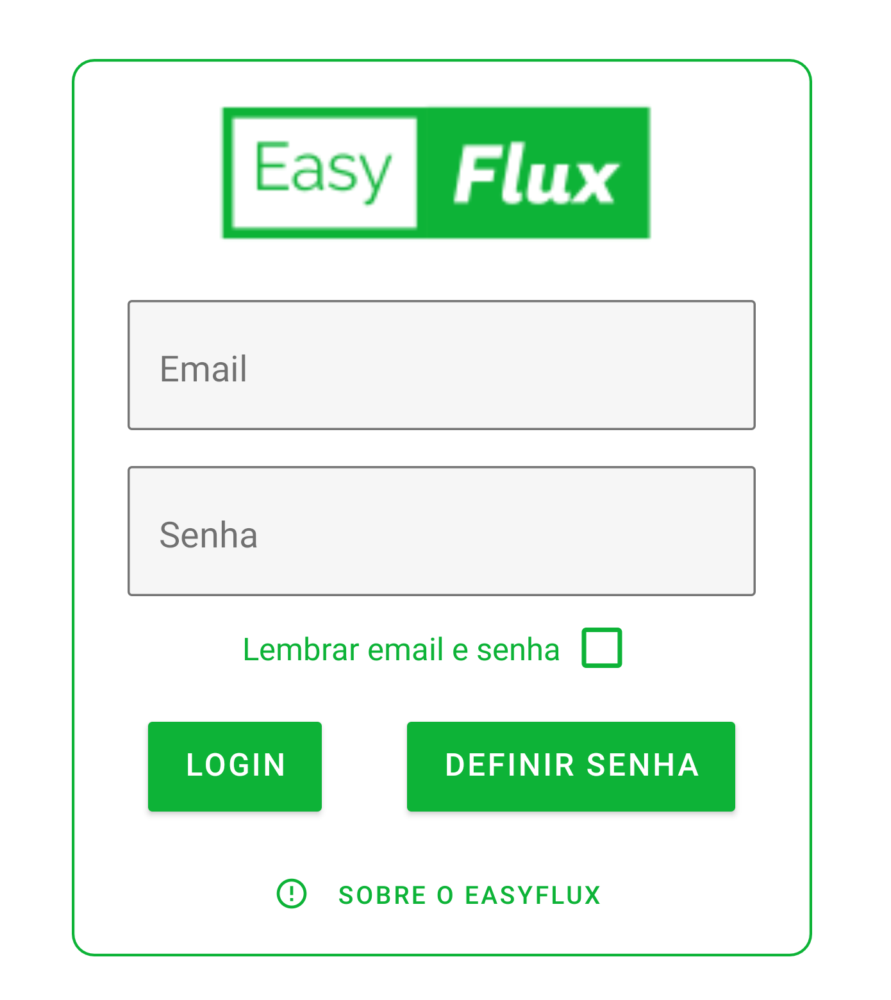

# EasyFlux - Cash management

O EasyFlux é um aplicativo que conecta ao banco de dados do seu
sistema ERP e realiza a leitura dos dados financeiros como: Faturamento,
saldo de caixa, total de contas a pagar e total de clientes a receber. Os
dados recebidos são transformados em informação de fácil consumo,
fornecendo para o usuário uma ampla visão da saúde financeira da
empresa, facilitando a tomada de decisão

## Tecnologias utilizadas

O EasyFlux foi desenvolvido com React Native (front-end do
aplicativo), Firebase (Back-end e banco de dados), React Native Paper
(biblioteca de componentes customizados para React Native) e Victory
(biblioteca de gráfico para React).

## Tela de Login

A tela de login do EasyFlux é a primeira tela a ser apresentada para o usuário.

Nela o usuário informará seu email e sua senha para entrar no app.

É possível armazenar as credenciais na memória do celular marcando a opção Lembrar email e senha.

O Botão de Definir senha tem apenas a funcionalidade de cadastrar uma senha para um usuário já registrado
pelo diretor no aplicativo.

### Sobre o EasyFlux
Ao clicar no botão Sobre o EasyFlux o usuário é redirecionado para a tela ao lado. Nesta tela, as informações
do desenvolvedor são exibidas e a localização do escritório da empresa.

Abaixo do mapa, o usuário tem acesso ao FAQ do aplicativo e a arquitetura do sistema. Na barra superior, no canto
direito, há um botão que redireciona para a tela de login.

