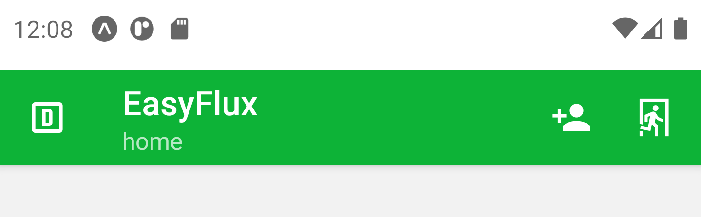

# EasyFlux - Cash management

O EasyFlux é um aplicativo que conecta ao banco de dados do seu
sistema ERP e realiza a leitura dos dados financeiros como: Faturamento,
saldo de caixa, total de contas a pagar e total de clientes a receber. Os
dados recebidos são transformados em informação de fácil consumo,
fornecendo para o usuário uma ampla visão da saúde financeira da
empresa, facilitando a tomada de decisão.

## Tecnologias utilizadas

O EasyFlux foi desenvolvido com React Native (front-end do
aplicativo), Firebase (Back-end e banco de dados), React Native Paper
(biblioteca de componentes customizados para React Native) e Victory
(biblioteca de gráficos para React).

## Tela de Login

A tela de login do EasyFlux é a primeira tela a ser apresentada para o usuário.

Nela o usuário informará seu email e sua senha para entrar no app.

É possível armazenar as credenciais na memória do celular marcando a opção Lembrar email e senha.

O Botão de Definir senha tem apenas a funcionalidade de cadastrar uma senha para um usuário já registrado
pelo diretor no aplicativo.

### Sobre o EasyFlux
Ao clicar no botão Sobre o EasyFlux o usuário é redirecionado para a tela ao lado. Nesta tela, as informações
do desenvolvedor são exibidas e a localização do escritório da empresa.

Abaixo do mapa, o usuário tem acesso ao FAQ do aplicativo e a arquitetura do sistema. Na barra superior, no canto
direito, há um botão que redireciona para a tela de login.

## Tela Home

A tela Home apresenta as principais informações financeiras que dão a visibilidade necessária dos resultados do
fluxo de caixa de um dia. Essa tela é apresentada logo após o usuário fazer o login.

### Funções da tela Home

A barra superior do EasyFlux oferece algumas informações e funcionalidades: As letras D, A e G identificando o cargo do usuário 
(D para diretor, A para analista e G para gestor), a informação da tela em foco (home) e os botões de cadastro de usuário e logout.

A tela home ao renderizar, buscará os dados financeiros do dia atual. Caso não haja lançamentos, a opção de cadastro é fornecida como
é apresentada na tela acima. Essa opção é habilitada apenas para os usuários Diretores.

Após a seleção da data, os primeiros indicadores apresentados são os percentuais dos totais das contas pagas e dos clientes recebidos. O
resultado do dia (Superávit ou Déficit) é resultado do total de valores recebidos deduzido do total de valores pagos.

As próximas informações apresentadas são os valores do fluxo de caixa (recebidos - pagos) e o saldo de caixa do dia. Os botões de histórico
direcionam para as telas de gráficos com os históricos dos últimos cinco dias.

Para os usuários Diretores, as opções de atualizar os dados e deletar os dados estão habilitadas. Para os usuários gestores e analistas,
apenas os valores de contas pagas e clientes recebidos estão habilitadas para atualização.

As telas correspondentes ao cadastro de novos usuários e tabela de usuários estão habilitadas apenas para os diretores. Para um novo
usuário poder usar o EasyFlux, um diretor precisa cadastrar o email no aplicativo. Após o cadastro, o novo usuário deve clicar no botão Definir
senha na tela de login para cadastrar uma senha de acesso.

## Tela de gráficos e tabelas

As telas de gráficos são renderizadas após o usuário clicar nos botões de histórico presentes na tela home. Por padrão, os últimos cinco
dias anteriores são selecionados a partir da data atual. Os gráficos apresentados são: Histórico do fluxo de caixa dos últimos cinco dias;
evolução do saldo final de caixa e evolução do faturamento. As tabelas apresentadas são: Registros dos fluxos de caixa; registro de contas
pagas e registros da inadimplência. Não havendo cinco dias de lançamentos, o número mínimo selecionado é de um dia.

## Cadastro e atualização dos dados

A tela de cadastro de valores está habilitada apenas para os usuários que são diretores da empresa. A tela de atualização está
habilitada para todos os usuários, porém para os gestores e analistas apenas os valores de clientes recebidos e contas pagas poderão ser
atualizados.

